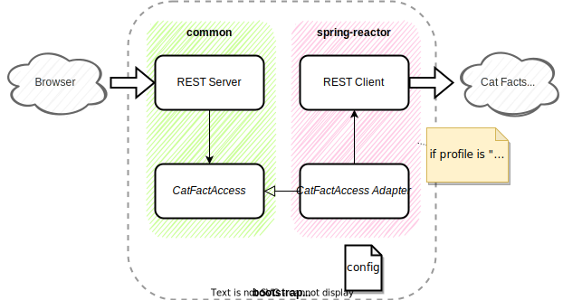

# Resilience4J sandbox

 

This application is a sandbox to test capabilities of [Resilience4J](https://resilience4j.readme.io).

It relies on calls to [Cat Facts API](https://alexwohlbruck.github.io/cat-facts/).

## Structure

* **bootstrap** is the entry point of the Spring Boot application. It includes the configuration of the application
  in [application.yml](./bootstrap/src/main/resources/application.yml).
* **common** contains the REST server as well as interfaces that are common to all "client" modules.
* **spring-reactor** uses [Resilience4j with Spring Reactor](https://resilience4j.readme.io/docs/getting-started-1).
* **spring-boot-2** uses
  [Resilience4j with Spring Boot 2 specifics](https://resilience4j.readme.io/docs/getting-started-3).

## Usage

Start application with one of the following profiles depending on the implementation of the REST client you want to use:

* spring-reactor
* spring-boot-2

Call `http://localhost:8080/random` from your browser. A random cat fact is expected to be displayed.

Call `http://localhost:8080/actuator/` to access Actuator endpoints. For instance:

* `http://localhost:8080/actuator/metrics/resilience4j.circuitbreaker.calls`
* `http://localhost:8080/actuator/metrics/resilience4j.circuitbreaker.state`
* `http://localhost:8080/actuator/metrics/resilience4j.circuitbreaker.failure.rate`

